**Objective of the Firmware:**

The firmware is designed to operate the Machine Learning Core (MLC) and the Intelligent Sensor Processing Unit (ISPU) on the STM32 board. It leverages the corresponding header files to configure and program the MLC and ISPU sensors. After initialization, the board enters sleep mode to conserve power, waiting for an event triggered by a new prediction. Upon detecting an event, the firmware identifies the sensor that triggered it, reads the prediction data, and transmits the results via the serial terminal and BLE channel. The firmware offers flexibility, allowing operation with either the MLC, the ISPU, or both.

**Hardware Components**

- **STM32 Microcontroller:** The firmware is specifically designed for the SensorTile.Box Pro board (STEVAL-MKBOXPRO), which features a powerful STM32 microcontroller for efficient processing and control.

- **Six-Axis Inertial Measurement Unit (LSM6DSV16X):** Combines an accelerometer and a gyroscope for motion detection and data acquisition, providing high-precision sensor readings.

- **On-board Bluetooth® Low Energy 5.2 (BlueNRG-LP):** Enables seamless wireless communication for transmitting prediction results to external devices like smartphones or PCs.

- **ISM330IS Sensor:** Features a 3-axis accelerometer and a 3-axis gyroscope with an embedded Intelligent Sensor Processing Unit (ISPU). This sensor is used to perform real-time motion tracking and advanced signal processing directly on the sensor, reducing the processing burden on the microcontroller and enhancing overall system efficiency.

**Connecting the ISPU Sensor and Debugger**

-  To integrate the ISPU sensor with the system, connect the sensor’s adapter to the **DIL24** socket on the SensorTile.Box Pro board.

- And in this way, you can connect the debugger and also make sure to connect the board to a power source using a **USB-C cable**.

  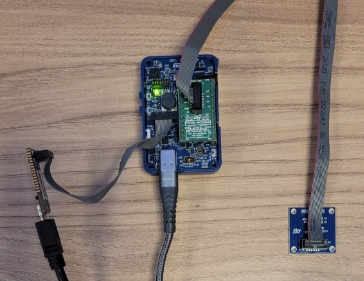

**Start**

To start configuring the project, open STM32CubeIDE and navigate to the “New Project” window. Select the “Board Selector” tab and search for STEVAL-MKBOXPRO in the Commercial Part Number field. Once the board appears in the list, select it and click “Start Project” to initialize a new project with the appropriate configuration for this evaluation board.

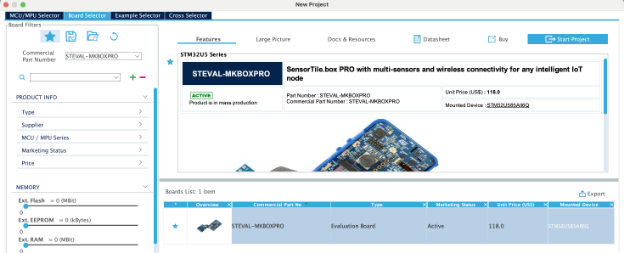

Set the clock **HCLK** to **160MHz** to utilize the maximum frequency.

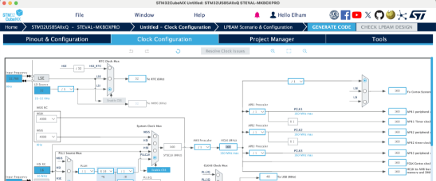

In the **RCC** section set the HSE and the LSE to **Crystal/Ceramic Resonator**.

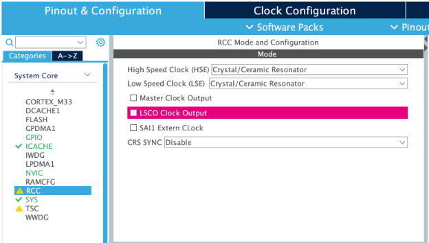

**GPIO Configuration**

PA4 and PG2 are set as GPIO\_EXTI to handle external interrupts. PA4 is configured to manage events from the MLC, while PG2 is dedicated to the ISPU. These configurations ensure that each sensor can trigger interrupts independently, allowing the firmware to respond to new predictions efficiently.

PB11 is configured as GPIO\_EXTI for BLE events, alongside PA4 for MLC and PG2 for ISPU. In the NVIC settings, the corresponding interrupt lines must be enabled: EXTI Line 2 for PG2, EXTI Line 4 for PA4, and EXTI Line 11 for PB11. This ensures that the firmware can handle interrupts from all three sources effectively.

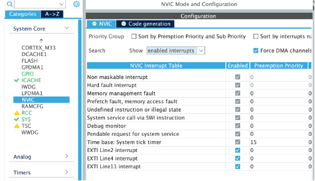

PA2 and PD4 are both configured as GPIO\_Output. PA2 is used for the BLE\_SPI\_CS\_line to control the chip select during SPI communication, while PD4 is assigned to the BLE\_SPI\_Resetline, enabling the microcontroller to reset the BLE module when required.

PI5 and PG1 are configured as GPIO\_Output, serving as the chip select (CS) lines for the LSM6DSV16X and ISM330IS sensors, respectively. Both are set to **High** by default, while PI0 is set to **Low**. This configuration disables the CS pins initially and prepares them to be activated (switched from High to Low) when the SPI2 connection starts. PI0, connected to MCU\_SEL, is configured to activate the SPI by overriding its default configuration for I2C. This setup ensures proper initialization and control of the SPI communication.

**Timer**

In this section, select TIM3, and set the **Clock Source** to **Internal Clock**. Then, in the **Parameter Settings**, set the **Prescaler** to **16000 - 1** and the **Period** to **10000 - 1**. This configuration ensures that the timer generates an event at the desired interval, controlling the duration of BLE advertising packets. Finally, ensure that the **TIM3 Update Interrupt** is enabled in the NVIC settings to handle the timer event. Since the system clock frequency is 160 MHz, the combination of the prescaler and period is chosen to achieve the required timing interval for BLE advertising.

**Connectivity Configuration**

**SPI2**

Under the **SPI2** section set the Mode to **Full Duplex Master**. Then in the **Parameter Settings**: set Data Size to 8 Bits, change the Prescaler such that the Baud Rate is lower or equal to 10.0 MBits/s, then choose CPOL High and CPHA 2 Edge. All these settings are standard and are needed to work with the **X-CUBE-MEMS1** pack, with the CUSTOM APIs.

The SPI2 pins used are PI1, PI3, and PI2, which correspond to SPI2\_SCK (clock), SPI2\_MOSI (Master Out Slave In), and SPI2\_MISO (Master In Slave Out), respectively. SPI2\_SCK on PI1 is configured with a Pull-up resistor to ensure proper signal integrity during operation. These pins are configured to facilitate reliable SPI communication for BLE functionality.

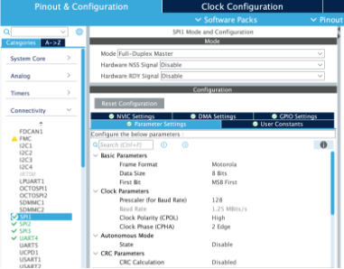

**SPI3**

The configuration for SPI3 is the same as SPI2, as described earlier, and it is used for connecting the ISPU sensor. The SPI3 pins are PG10, PG9, and PB5, which correspond to SPI3\_MISO (Master In Slave Out), SPI3\_SCLK (clock), and SPI3\_MOSI (Master Out Slave In), respectively. Like SPI2, ensure that the SPI3\_SCLK (PG9) is configured with a Pull-up resistor to maintain proper signal integrity during operation. This setup allows reliable SPI communication with the ISPU sensor.

**SPI1**

To configure SPI1 for the BLE component, set the SPI Mode to Full-Duplex Master. In the Parameter Settings, configure the following: set the Data Size to 8 Bits, the Clock Polarity (CPOL) to High, and the Clock Phase (CPHA) to 2 Edge. Adjust the Prescaler to achieve a Baud Rate of 1.25 MBits/s.

For the GPIO configuration, the SPI1 pins are as follows: PA5 is configured as SPI1\_SCK (clock) with a Pull-up resistor to ensure signal stability, PA6 as SPI1\_MISO (Master In Slave Out) without pull-up or pull-down resistors, and PA7 as SPI1\_MOSI (Master Out Slave In) also without pull-up or pull-down resistors. This setup ensures reliable communication with the BLE component through SPI1.

**UART4**

To configure UART4 for communicating with the serial terminal, set the mode to **Asynchronous** and disable hardware flow control. In the Parameter Settings, set the Baud Rate to **230400 Bits/s**, Word Length to **8 Bits**, Parity to **None**, and Stop Bits to **1**. These settings ensure efficient and reliable communication with the serial terminal.

The GPIO configuration for UART4 uses PA0 and PA1 as the TX and RX signals, respectively. Both pins are set to **Alternate Function** mode with no pull-up or pull-down resistors applied. This setup facilitates proper data transmission and reception between the microcontroller and the serial terminal.

**Software pack selection**

In this part 3 software packs must be chosen with the configuration shown:

- **X-CUBE-BLEMGR**
- **X-CUBE-ISPU**
- **X-CUBE-MEMS1**

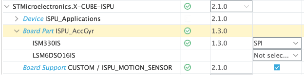

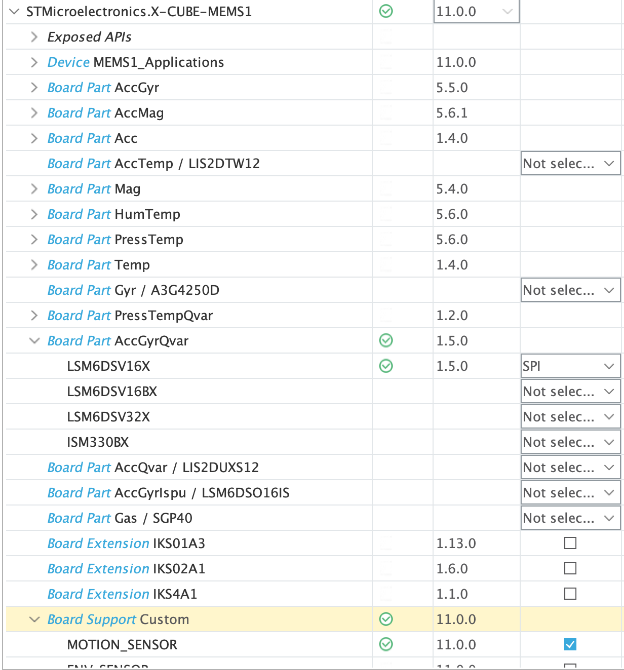

In the Platform Settings of the X-CUBE-MEMS1 connect the sensor to the MCU pins previously chosen.

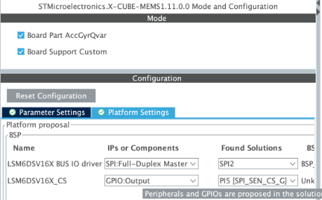

In the Platform Settings of the X-CUBE-ISPU connect the sensor to the MCU pins previously chosen.

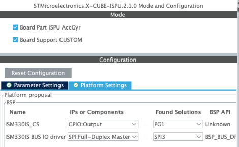

- And also, for X-CUBE-BLEMGR:

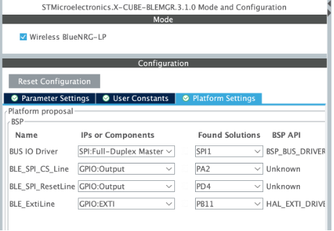

Finally, in the **Project Manager** section, choose Project Name and directory, Toolchain STM32CubeIDE and deselect the Generation under root.
